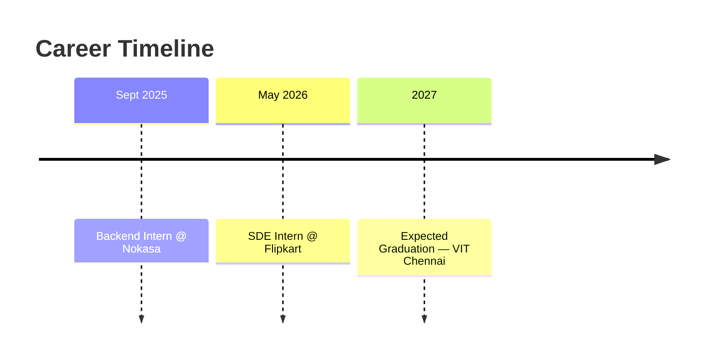
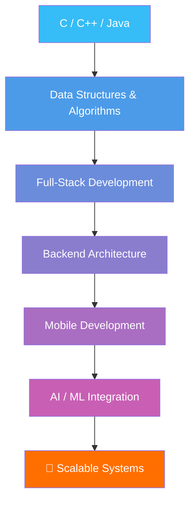

<div align="center">


<br/>

<a href="https://github.com/Nitin-singh03">
  
</a>


</div>


## 🧑‍💻 About Me

I'm a **Computer Science student at VIT Chennai**, specializing in **Artificial Intelligence & Machine Learning**, with an expected graduation in **2027**.

I enjoy working at the intersection of **software engineering, scalable backend systems, mobile development, and AI**.

```yaml
interests:
  - 🚀 Building scalable full-stack applications
  - ⚙️ Designing modular backend architectures
  - 📱 Developing modern mobile experiences
  - 🤖 Integrating AI into real-world applications
  - 🧠 Competitive programming & algorithmic problem solving
  - 🔐 Exploring secure and privacy-preserving systems
```

<div align="center">

> ### *"Build it. Break it. Understand it. Make it better."*

</div>


## 🛠️ Tech Stack

### 💻 Languages
<p>


</p>

### 🌐 Full-Stack Development
<p>


</p>

### 🗄️ Databases & Infrastructure
<p>


</p>

### 🧠 Core Concepts
<p>


</p>


## 💼 Experience

<table>
<tr>
<td width="50%" valign="top">

### 🟡 SDE Intern
**Flipkart** &nbsp;·&nbsp; *May 2026 – July 2026*

- 📱 Worked on **Flipkart's internal tools** for UI design and application development using **React Native**
- 🏗️ Contributed to **application architecture design** and performance optimization to improve overall user experience
- 🧩 Engineered **modular mobile UI components** for scalable application development
- ⚡ Implemented a **custom Server-Driven UI architecture**, enabling dynamic UI configuration and improving development flexibility

</td>
<td width="50%" valign="top">

### 🔵 Backend Intern
**Nokasa** &nbsp;·&nbsp; *September 2025 – April 2026*

- ⚙️ Designed **scalable database schemas** and developed robust backend services using **Node.js and Express.js**
- 🏗️ Contributed to architectural planning and setup of a **high-performance backend system**
- 🔧 Focused on modularity, maintainability, and long-term scalability of backend services
- 🚀 Applied software engineering best practices while developing production-oriented backend infrastructure

</td>
</tr>
</table>

<div align="center">



</div>


## 🧠 Competitive Programming

I enjoy competitive programming because it forces me to think beyond simply making code work.

<div align="center">

| Platform | Achievement | Rating |
|:---:|:---:|:---:|
| 🟢 **LeetCode** | 700+ Problems Solved | **1896** |
| 🔵 **Codeforces** | Specialist | **1501** |
| 🟡 **CodeChef** | 3 ⭐ | **1673** |


</div>


## 🐍 Contribution Activity

<div align="center">

</div>


## 🎯 Currently Exploring

<div align="center">

| | |
|---|---|
| 🤖 | Artificial Intelligence & Machine Learning |
| 🧠 | Advanced Data Structures & Algorithms |
| ⚡ | High-Performance Backend Systems |
| 📱 | React Native & Mobile Architecture |
| 🔐 | Secure & Privacy-Preserving Systems |
| ☁️ | Cloud & Distributed Systems |

</div>

## 📈 My Developer Journey




## 🤝 Let's Connect

<div align="center">

<a href="https://github.com/Nitin-singh03">

</a>
<a href="https://www.linkedin.com/in/nitin-singh-b76213334/">

</a>
<a href="https://nitin-singh03.github.io/portfolio/">

</a>
<a href="mailto:nitin0309singh@gmail.com">

</a>

<br/><br/>

### ⭐ If you find my work interesting, consider starring a repository!

**Thanks for visiting! 🚀**


</div>
